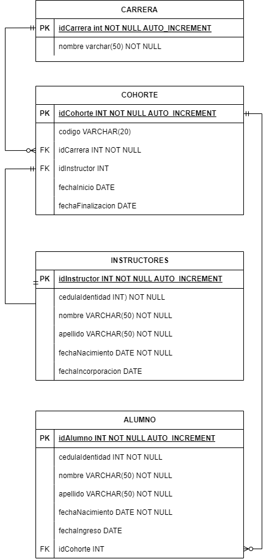

Crear un modelo relacional basado en el modelo de negocios de Henry:

1.  Identificar las **relaciones**.
2.  Identifcar **primary key´s** y **foreing key´s**.
3.  Definir los **tipos de datos**.

La entidades a modelar junto sus atributos son:  

-   Carrera: 
	- ID, 
	- Nombre.  
    
-   Cohorte: 
	- ID, 
	- Código, 
	- Carrera, 
	- Fecha de Inicio, 
	- Fecha de Finalización, 
	- Instructor.  
    
-   Instructores: 
	- ID, 
	- Cédula de identidad, 
	- Nombre, 
	- Apellido, 
	- Fecha de Nacimiento, 
	- Fecha de Incorporación.  
    
-   Alumnos: 
	- ID, 
	- Cédula de identidad, 
	- Nombre, Apellido, 
	- Fecha de Nacimiento, 
	- Fecha de Ingreso, 
	- Cohorte.  




# Código

```sql
-- CREA LA BASE DE DATOS henry
CREATE DATABASE henry;

-- INDICA A QUÉ BASE DE DATOS REFIEREN LAS SIGUIENTES INSTRUCCIONES
USE henry;

-- CREA LA TABLA CARRERA
CREATE TABLE carrera (
idCarrera INT NOT NULL AUTO_INCREMENT,
nombre VARCHAR (20) NOT NULL,
PRIMARY KEY (idCarrera)
);


SELECT *
FROM carrera;

/*Esto es un comentario

multilinea*/

-- Esto no

-- CREA LA TABLA INSTRUCTOR
CREATE TABLE instructor (
idInstructor INT NOT NULL AUTO_INCREMENT ,
cedulaIdentidad VARCHAR(25) NOT NULL,
nombre VARCHAR (45) NOT NULL,
apellido VARCHAR (45) NOT NULL,
fechaNacimiento DATE NOT NULL,
fechaIncorporacion DATE,
PRIMARY KEY (idInstructor)
);


-- CREA LA TABLA cohorte
CREATE TABLE cohorte (
idCohorte INT NOT NULL AUTO_INCREMENT,
codigo VARCHAR (45) NOT NULL,
idCarrera INT NOT NULL,
idInstructor INT,
fechaInicio DATE,
fechaFinalizacion DATE,
PRIMARY KEY (idCohorte),
FOREIGN KEY (idCarrera) REFERENCES carrera(idCarrera),
FOREIGN KEY (idInstructor) REFERENCES instructor(idInstructor)
);

-- CREA LA TABLA ALUMNO
CREATE TABLE alumno (
idAlumno INT NOT NULL AUTO_INCREMENT ,
cedulaIdentidad VARCHAR(25) NOT NULL,
nombre VARCHAR (45) NOT NULL,
apellido VARCHAR (45) NOT NULL,
fechaNacimiento DATE NOT NULL,
fechaIngreso DATE,
idCohorte INT,
PRIMARY KEY (idAlumno),
FOREIGN KEY (idCohorte) REFERENCES cohorte(idCohorte)
);

SELECT *

FROM alumno;
```


```sql
  
INSERT INTO carrera

VALUES (1,'Fullstack Developer'),

(2, 'Data Scientist');


INSERT INTO instructor

VALUES (1,15050678, 'Ricardo', 'Montaner', '1987-03-01', null),

(2,39000000, 'Pablo José', 'Romero', '1995-08-15', '2022-06-06');


INSERT INTO cohorte

VALUES (1,'DATA01',1,1,'2022-01-01',null),

(2,'DATA02',1,1,'2022-03-01',null),

(3,'DATA03',1,1,'2022-04-01',null);


-- Insertar forma 2

INSERT INTO alumno (cedulaIdentidad, nombre, apellido, fechaNacimiento, fechaIngreso, idCohorte)

VALUES (44123456, 'Pepito', 'González', '1995-08-15', '2022-04-01', 1),

(1200, 'Roque', 'Peña', '1890-08-15', '2022-04-01', 1),

(33123476, 'Pepita', 'Romero', '1995-08-15', '2022-04-01', 1);

TRUNCATE TABLE alumno;

SELECT *

FROM alumno;

SELECT *

FROM carrera;

SELECT *

FROM instructor;

SELECT *

FROM cohorte;


-- where

SELECT *

FROM instructor

WHERE apellido LIKE '%a';

SELECT *

FROM instructor

WHERE fechaNacimiento < '1990-01-01';

SELECT *

FROM instructor

WHERE fechaNacimiento BETWEEN '1990-01-01' AND '2000-01-01';

UPDATE instructor

SET nombre = 'Juan', apellido = 'Tolosa'

WHERE idInstructor = 2;

SELECT count(idAlumno) as NumAlumn

FROM alumno;

SELECT count(*) as NumC

FROM cohorte;
```


[Más ejemplos](https://github.com/soyHenry/DS-M2/blob/main/Clase%2006/Clase07.sql)

